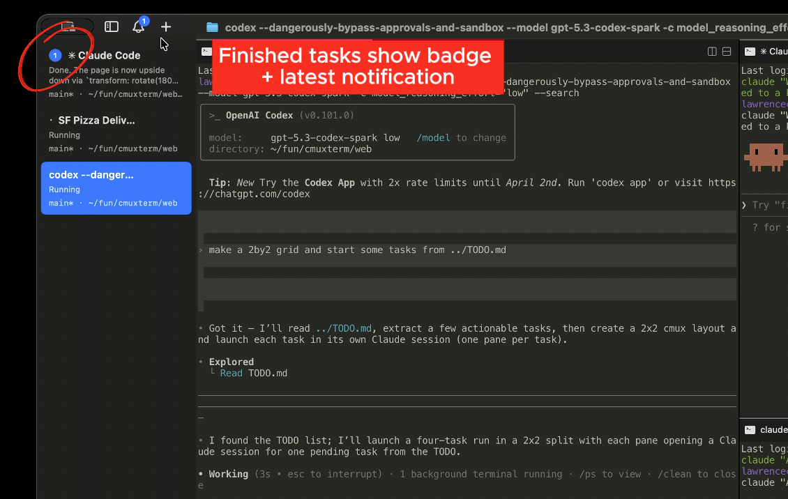
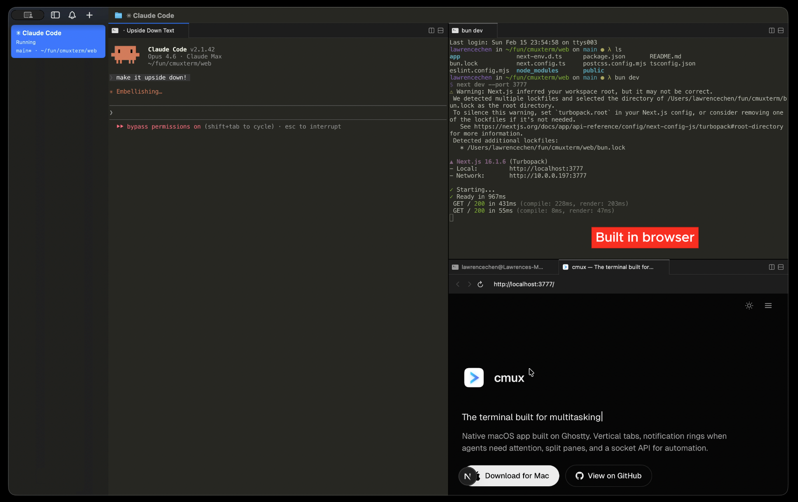
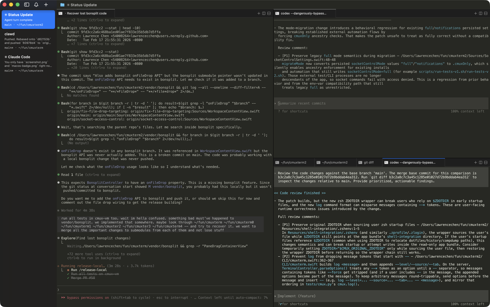

> Цей переклад було згенеровано за допомогою Claude. Якщо у вас є пропозиції щодо покращень, відкрийте PR.

<h1 align="center">cmux</h1>
<p align="center">Термінал macOS на базі Ghostty з вертикальними вкладками та сповіщеннями для AI-агентів програмування</p>

<p align="center">
  <a href="https://github.com/manaflow-ai/cmux/releases/latest/download/cmux-macos.dmg">
    
  </a>
</p>

<p align="center">
  <a href="README.md">English</a> | <a href="README.ja.md">日本語</a> | <a href="README.vi.md">Tiếng Việt</a> | <a href="README.zh-CN.md">简体中文</a> | <a href="README.zh-TW.md">繁體中文</a> | <a href="README.ko.md">한국어</a> | <a href="README.de.md">Deutsch</a> | <a href="README.es.md">Español</a> | <a href="README.fr.md">Français</a> | <a href="README.it.md">Italiano</a> | <a href="README.da.md">Dansk</a> | <a href="README.pl.md">Polski</a> | <a href="README.ru.md">Русский</a> | <a href="README.bs.md">Bosanski</a> | <a href="README.ar.md">العربية</a> | <a href="README.no.md">Norsk</a> | <a href="README.pt-BR.md">Português (Brasil)</a> | <a href="README.th.md">ไทย</a> | <a href="README.tr.md">Türkçe</a> | <a href="README.km.md">ភាសាខ្មែរ</a> | Українська
</p>

<p align="center">
  <a href="https://x.com/manaflowai"></a>
  <a href="https://discord.gg/xsgFEVrWCZ"></a>
</p>

<p align="center">
  
</p>

<p align="center">
  <a href="https://www.youtube.com/watch?v=i-WxO5YUTOs">▶ Демо-відео</a> · <a href="https://cmux.com/blog/zen-of-cmux">Філософія cmux</a>
</p>

## Можливості

<table>
<tr>
<td width="40%" valign="middle">
<h3>Кільця сповіщень</h3>
Панелі отримують синє кільце, а вкладки підсвічуються, коли агенти програмування потребують вашої уваги
</td>
<td width="60%">

</td>
</tr>
<tr>
<td width="40%" valign="middle">
<h3>Панель сповіщень</h3>
Переглядайте всі очікувані сповіщення в одному місці, переходьте до останнього непрочитаного
</td>
<td width="60%">

</td>
</tr>
<tr>
<td width="40%" valign="middle">
<h3>Вбудований браузер</h3>
Розділіть браузер поруч із терміналом зі скриптовим API, портованим з <a href="https://github.com/vercel-labs/agent-browser">agent-browser</a>
</td>
<td width="60%">

</td>
</tr>
<tr>
<td width="40%" valign="middle">
<h3>Вертикальні та горизонтальні вкладки</h3>
Бічна панель показує гілку git, статус/номер пов'язаного PR, робочу директорію, порти прослуховування та текст останнього сповіщення. Розділяйте горизонтально та вертикально.
</td>
<td width="60%">

</td>
</tr>
</table>

- **Скриптований** — CLI та socket API для створення робочих просторів, розділення панелей, надсилання натискань клавіш та автоматизації браузера
- **Нативний додаток macOS** — Побудований на Swift та AppKit, не Electron. Швидкий запуск, мало пам'яті.
- **Сумісний з Ghostty** — Читає вашу існуючу конфігурацію `~/.config/ghostty/config` для тем, шрифтів та кольорів
- **Прискорення GPU** — На базі libghostty для плавного рендерингу

## Встановлення

### DMG (рекомендовано)

<a href="https://github.com/manaflow-ai/cmux/releases/latest/download/cmux-macos.dmg">
  
</a>

Відкрийте `.dmg` та перетягніть cmux до папки Applications. cmux автоматично оновлюється через Sparkle, тому завантажити потрібно лише один раз.

### Homebrew

```bash
brew tap manaflow-ai/cmux
brew install --cask cmux
```

Для оновлення пізніше:

```bash
brew upgrade --cask cmux
```

При першому запуску macOS може попросити підтвердити відкриття програми від ідентифікованого розробника. Натисніть **Відкрити**, щоб продовжити.

## Чому cmux?

Я запускаю багато сесій Claude Code та Codex паралельно. Я використовував Ghostty з купою розділених панелей і покладався на нативні сповіщення macOS, щоб знати, коли агенту потрібна моя увага. Але тіло сповіщення Claude Code завжди було просто "Claude is waiting for your input" без контексту, і з достатньою кількістю вкладок я навіть не міг прочитати заголовки.

Я спробував кілька оркестраторів програмування, але більшість з них були додатками на Electron/Tauri, і продуктивність мене турбувала. Я також просто віддаю перевагу терміналу, оскільки GUI-оркестратори прив'язують вас до свого робочого процесу. Тому я створив cmux як нативний додаток macOS на Swift/AppKit. Він використовує libghostty для рендерингу терміналу та читає вашу існуючу конфігурацію Ghostty для тем, шрифтів та кольорів.

Основні доповнення — це бічна панель та система сповіщень. Бічна панель має вертикальні вкладки, які показують гілку git, статус/номер пов'язаного PR, робочу директорію, порти прослуховування та текст останнього сповіщення для кожного робочого простору. Система сповіщень підхоплює термінальні послідовності (OSC 9/99/777) та має CLI (`cmux notify`), який можна підключити до хуків агентів для Claude Code, OpenCode тощо. Коли агент чекає, його панель отримує синє кільце, а вкладка підсвічується у бічній панелі, тому я бачу, який саме потребує мене серед розділень та вкладок. Cmd+Shift+U переходить до останнього непрочитаного.

Вбудований браузер має скриптовий API, портований з [agent-browser](https://github.com/vercel-labs/agent-browser). Агенти можуть робити знімок дерева доступності, отримувати посилання на елементи, клікати, заповнювати форми та виконувати JS. Ви можете розділити панель браузера поруч із терміналом і дозволити Claude Code взаємодіяти з вашим dev-сервером напряму.

Все скриптується через CLI та socket API — створення робочих просторів/вкладок, розділення панелей, надсилання натискань клавіш, відкриття URL у браузері.

## Філософія cmux

cmux не нав'язує розробникам, як використовувати їхні інструменти. Це термінал і браузер із CLI, а решта — за вами.

cmux — це примітив, а не рішення. Він дає вам термінал, браузер, сповіщення, робочі простори, розділення, вкладки та CLI для керування всім цим. cmux не змушує вас дотримуватися нав'язаного способу використання агентів програмування. Те, що ви створите з цих примітивів — ваше.

Найкращі розробники завжди створювали власні інструменти. Ніхто ще не з'ясував найкращий спосіб роботи з агентами, і команди, що створюють закриті продукти, точно цього не зробили. Розробники, які найближче до своїх кодових баз, з'ясують це першими.

Дайте мільйону розробників компоновані примітиви, і вони колективно знайдуть найефективніші робочі процеси швидше, ніж будь-яка продуктова команда могла б спроєктувати зверху вниз.

## Документація

Для додаткової інформації про налаштування cmux [перейдіть до нашої документації](https://cmux.com/docs/getting-started?utm_source=readme).

## Клавіатурні скорочення

### Робочі простори

| Скорочення | Дія |
|----------|--------|
| ⌘ N | Новий робочий простір |
| ⌘ 1–8 | Перейти до робочого простору 1–8 |
| ⌘ 9 | Перейти до останнього робочого простору |
| ⌃ ⌘ ] | Наступний робочий простір |
| ⌃ ⌘ [ | Попередній робочий простір |
| ⌘ ⇧ W | Закрити робочий простір |
| ⌘ ⇧ R | Перейменувати робочий простір |
| ⌘ B | Перемкнути бічну панель |

### Поверхні

| Скорочення | Дія |
|----------|--------|
| ⌘ T | Нова поверхня |
| ⌘ ⇧ ] | Наступна поверхня |
| ⌘ ⇧ [ | Попередня поверхня |
| ⌃ Tab | Наступна поверхня |
| ⌃ ⇧ Tab | Попередня поверхня |
| ⌃ 1–8 | Перейти до поверхні 1–8 |
| ⌃ 9 | Перейти до останньої поверхні |
| ⌘ W | Закрити поверхню |

### Розділені панелі

| Скорочення | Дія |
|----------|--------|
| ⌘ D | Розділити праворуч |
| ⌘ ⇧ D | Розділити вниз |
| ⌥ ⌘ ← → ↑ ↓ | Фокус панелі за напрямком |
| ⌘ ⇧ H | Підсвітити активну панель |

### Браузер

Клавіатурні скорочення інструментів розробника браузера відповідають стандартним Safari та налаштовуються в `Налаштування → Клавіатурні скорочення`.

| Скорочення | Дія |
|----------|--------|
| ⌘ ⇧ L | Відкрити браузер у розділенні |
| ⌘ L | Фокус на адресному рядку |
| ⌘ [ | Назад |
| ⌘ ] | Вперед |
| ⌘ R | Перезавантажити сторінку |
| ⌥ ⌘ I | Перемкнути Інструменти розробника (стандарт Safari) |
| ⌥ ⌘ C | Показати консоль JavaScript (стандарт Safari) |

### Сповіщення

| Скорочення | Дія |
|----------|--------|
| ⌘ I | Показати панель сповіщень |
| ⌘ ⇧ U | Перейти до останнього непрочитаного |

### Пошук

| Скорочення | Дія |
|----------|--------|
| ⌘ F | Знайти |
| ⌘ G / ⌘ ⇧ G | Знайти наступне / попереднє |
| ⌘ ⇧ F | Сховати панель пошуку |
| ⌘ E | Використати виділення для пошуку |

### Термінал

| Скорочення | Дія |
|----------|--------|
| ⌘ K | Очистити буфер прокрутки |
| ⌘ C | Копіювати (з виділенням) |
| ⌘ V | Вставити |
| ⌘ + / ⌘ - | Збільшити / зменшити розмір шрифту |
| ⌘ 0 | Скинути розмір шрифту |

### Вікно

| Скорочення | Дія |
|----------|--------|
| ⌘ ⇧ N | Нове вікно |
| ⌘ , | Налаштування |
| ⌘ ⇧ , | Перезавантажити конфігурацію |
| ⌘ Q | Вийти |

## Нічні збірки

[Завантажити cmux NIGHTLY](https://github.com/manaflow-ai/cmux/releases/download/nightly/cmux-nightly-macos.dmg)

cmux NIGHTLY — це окремий додаток з власним bundle ID, тому він працює поруч зі стабільною версією. Збирається автоматично з останнього коміту `main` та автоматично оновлюється через власний канал Sparkle.

Повідомляйте про помилки нічних збірок на [GitHub Issues](https://github.com/manaflow-ai/cmux/issues) або в [#nightly-bugs у Discord](https://discord.gg/xsgFEVrWCZ).

## Відновлення сесії (поточна поведінка)

При перезапуску cmux наразі відновлює лише макет та метадані додатку:
- Макет вікон/робочих просторів/панелей
- Робочі директорії
- Буфер прокрутки терміналу (наскільки можливо)
- URL браузера та історію навігації

cmux **не** відновлює стан активних процесів усередині термінальних додатків. Наприклад, активні сесії Claude Code/tmux/vim поки що не відновлюються після перезапуску.

## Історія зірок

<a href="https://star-history.com/#manaflow-ai/cmux&Date">
 <picture>
   <source media="(prefers-color-scheme: dark)" srcset="https://api.star-history.com/svg?repos=manaflow-ai/cmux&type=Date&theme=dark" />
   <source media="(prefers-color-scheme: light)" srcset="https://api.star-history.com/svg?repos=manaflow-ai/cmux&type=Date" />
   
 </picture>
</a>

## Участь у проєкті

Способи долучитися:

- Підписуйтесь на нас у X для оновлень [@manaflowai](https://x.com/manaflowai), [@lawrencecchen](https://x.com/lawrencecchen) та [@austinywang](https://x.com/austinywang)
- Приєднуйтесь до обговорень у [Discord](https://discord.gg/xsgFEVrWCZ)
- Створюйте та беріть участь у [GitHub issues](https://github.com/manaflow-ai/cmux/issues) та [обговореннях](https://github.com/manaflow-ai/cmux/discussions)
- Розкажіть нам, що ви створюєте з cmux

## Спільнота

- [Discord](https://discord.gg/xsgFEVrWCZ)
- [GitHub](https://github.com/manaflow-ai/cmux)
- [X / Twitter](https://twitter.com/manaflowai)
- [YouTube](https://www.youtube.com/channel/UCAa89_j-TWkrXfk9A3CbASw)
- [LinkedIn](https://www.linkedin.com/company/manaflow-ai/)
- [Reddit](https://www.reddit.com/r/cmux/)

## Founder's Edition

cmux є безкоштовним, з відкритим кодом і завжди буде таким. Якщо ви хочете підтримати розробку та отримати ранній доступ до того, що буде далі:

**[Отримати Founder's Edition](https://buy.stripe.com/3cI00j2Ld0it5OU33r5EY0q)**

- **Пріоритетні запити на функції/виправлення помилок**
- **Ранній доступ: cmux AI, що надає контекст для кожного робочого простору, вкладки та панелі**
- **Ранній доступ: додаток iOS з терміналами, синхронізованими між комп'ютером та телефоном**
- **Ранній доступ: хмарні VM**
- **Ранній доступ: голосовий режим**
- **Мій особистий iMessage/WhatsApp**

## Ліцензія

cmux є відкритим програмним забезпеченням під ліцензією [AGPL-3.0-or-later](LICENSE).

Якщо ваша організація не може дотримуватися AGPL, доступна комерційна ліцензія. Зв'яжіться з [founders@manaflow.com](mailto:founders@manaflow.com) для деталей.
